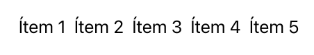

<!--
** Title: Result builders en Swift (2)
** Date: 
** Tags: Swift, Lenguajes de programación
-->

# Result builders en Swift (2) #

En el [post anterior](../../0001-resultbuilders-1.md) de la serie
sobre _result builders_ vimos cómo éstos permiten utilizar un DSL para
definir una clausura o un bloque de código que construye un componente
a partir de componentes elementales.

Vimos el ejemplo sencillo de un constructor de cadenas:

```swift
@resultBuilder
struct StringConcatenator {
    static func buildBlock(_ components: String...) -> String {
        return components.joined(separator: ", ")
    }
}
```

El código anterior crea la anotación `@StringConcatenator` que podemos usar
para aplicar el _result builder_. Por ejemplo, podemos aplicarlo a la
definición de una función:

```swift
@StringConcatenator
func holaMundo() -> String {
    "Hola"
    "mundo"
}

print(holaMundo())
// Imprime: Hola, mundo
```

La función anterior construye una cadena uniendo las cadenas
elementales que definimos en su cuerpo. Recordemos que el _result
builder_ transforma en tiempo de compilación este cuerpo,
convirtiéndolo en algo como:

```swift
func holaMundo() -> String {
    let v0 = "Hola"
    let v1 = "mundo"
    return StringConcatenator.buildBlock(v0, v1)
}
```

Por último, terminamos explicando que si anotábamos con el atributo un
parámetro de una función, el _result builder_ se aplicaba a la clausura
que se pasaba como parámetro. Algo interesante porque permite usar el
_result builder_ sin que aparezca la anotación:

```swift
func imprimeSaludo(@StringConcatenator _ contenido: () -> String) {
    print(contenido())
}

// Llamamos a la función con una clausura que usa el DSL.
// No es necesario añadir la anotación @StringConcatenator.
imprimeSaludo {
    "Hola"
    "mundo"
}
// Imprime: Hola, mundo
```

En este segundo post a ver otros lugares en los que se puede usar el
atributo del _result builder_ y vamos a conocer más cosas sobre su
construcción, estudiando otros elementos que puede contener.

## Result builders en inicializadores ##

En SwiftUI se utiliza el _result builder_
[ViewBuilder](https://developer.apple.com/documentation/swiftui/viewbuilder)
para construir vistas. Un ejemplo es el siguiente:

```swift
let vista = 
    HStack {
        ForEach(
            1...5,
            id: \.self
        ){
            Text("Item \($0)")
        }
    }
```

La vista construida es una pila horizontal con cinco subvistas de tipo
`Text`:



Vemos que el `HStack` recibe una clausura con código DSL que
especifica las subvistas. El _ViewBuilder_ transformará ese DSL en
código Swift. 

¿Por qué no tenemos que usar el atributo `@ViewBuilder`?. La
explicación está en que ese atributo se ha usado en un parámetro de
una función. En concreto en un parámetro del inicializador de
`HStack`.

Vamos a hacer nosotros algo similar.

### Ejemplo de _result builder_ en inicializador  ###

Supongamos la siguiente estructura `Persona`:

```swift
struct Persona {
    let contenido: () -> String

    var saludo: String {
        contenido()
    }

    init(@StringConcatenator contenido: @escaping () -> String) {
        self.contenido = contenido
    }
}
```

Estamos definiendo una estructura con una variable almacenada
`contenido` que contiene una clausura sin parámetros que devuelve una
cadena. Y una variable calculada `saludo` que devuelve la cadena
resultante de ejecutar esa clausura.

Para inicializar una `Persona` con el método `init` debemos pasar como
argumento la clausura que va a generar el saludo. En el método
definimos ese parámetro con el atributo `@StringConcatenator` para
indicar que vamos a pasar un argumento que debe ser transformado por
el _result builder_. El atributo `@escaping` no es importante; tiene
que ver con la forma de gestionar el ámbito de la clausura y el
compilador da un error si no lo ponemos.

Ahora ya podemos crear una instancia de `Persona` pasando una clausura
que usa el DSL:

```swift
let frodo = Persona {
    "Hola"
    "me"
    "llamo"
    "Frodo"
}
```

Una vez construida la instancia, se habrá guardado en su propiedad
`contenido` la clausura que devuelve el saludo. Llamamos a la clausura
accediendo a la propiedad `saludo`:

```swift
print(frodo.saludo)
```

Se imprime:

```text
Hola, me. llamo, Frodo
```

### Simplificando el inicializador ###

A los ingenieros que diseñaron los _result builders_ se les ocurrió un
_azucar sintáctico_ que permite hacer más sencilla todavía la
construcción anterior.

Dado que las estructuras en Swift generan automáticamente un
[inicializador
memberwise](https://docs.swift.org/swift-book/LanguageGuide/Initialization.html#ID213),
se podría usar el atributo del _result builder_ directamente en la
propiedad. No tenemos que definir el inicializador porque Swift lo
crea automáticamente:

```swift
struct PersonaSimple {
    @StringConcatenator let contenido: () -> String

    var saludo: String {
        contenido()
    }
}
```

No hace falta especificar nada más. Swift genera automáticamente el inicializador de
la estructura correctamente y podemos usarlo de la misma forma que antes:

```swift
let frodo2 = PersonaSimple {
    "Hola"
    "me"
    "llamo"
    "Frodo"
}

print(frodo2.saludo)
// Imprime: Hola, me, llamo, Frodo
```

Esta forma de definir un _result builder_ es una de las más usadas. Se
utiliza en la gran mayoría de DSLs construidos en Swift, incluido
SwiftUI.

## Result builders en protocolos ##

Otra forma de aplicar un _result builder_ sin usar explícitamente la
anotación correspondiente es mediante un protocolo. Si marcamos con la
anotación un método o una propiedad de un protocolo se aplicará el
_result builder_ en el código que adopta el protocolo.

Vamos a seguir con el ejemplo del saludo construido con el
`@StringConcatenator`. Podemos definir un protocolo con una
propiedad con el saludo:

```swift
protocol Educado {
    @StringConcatenator var saludo: String {get}
}
```

Al definir de esta forma la propiedad, cualquier tipo que adopte el
protocolo `Educado` deberá definir una propiedad `saludo` en la que se
podrá usar el _result builder_. Por ejemplo, definimos la estructura
`PersonaEducada` de la siguiente forma:

```swift
struct PersonaEducada: Educado {
    var nombre: String
    var saludo: String {
        "Hola"
        "me"
        "llamo"
        nombre
    }
}
```

Estamos definiendo el `saludo` con las cadenas que se muestran en las
distintas sentencias (`"Hola"`, `"me"`, `"llamo"`) y la propiedad
`nombre`. El _result builder_ `@StringConcatenator` transformará este
código de la forma que hemos visto anteriormente.

Al ser `saludo` una variable calculada, la única variable almacenada
que hay que especificar al crear la estructura es el `nombre` de la
persona. Lo hacemos de la forma siguiente, llamando al inicializador
_memberwise_ creado automáticamente:

```swift
let gandalf = PersonaEducada(nombre: "Gandalf")
```

Y, una vez creada la instancia de una `PersonaEducada` podemos pedir
su saludo:

```swift
print(gandalf.saludo)

```

Como siempre, se imprimirá:

```text
Hola, me, llamo, Gandalf
```


## Expresiones, componentes y resultados finales ##

```swift
@resultBuilder
struct ArrayBuilder {
    static func buildExpression(_ expression: Int) -> [Int] {
        return [expression]
    }

    static func buildBlock(_ components: [Int]...) -> [Int] {
        return Array(components.joined())
    }

    static func buildFinalResult(_ component: [Int]) -> [Double] {
        component.map {Double($0)}
    }
}

@ArrayBuilder
func buildArray() -> [Double] {
    100
    200
    300
}

print(buildArray())
```

## Referencias ##
